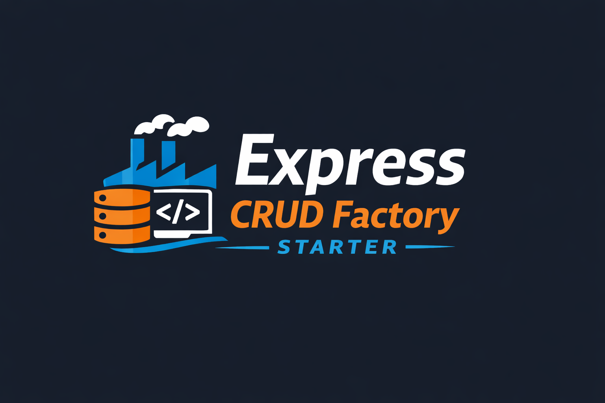

# Express CRUD Factory Starter

[](https://www.npmjs.com/package/express-crud-factory) [](https://github.com/VishalPaswan2402/express-crud-factory) [](https://github.com/VishalPaswan2402/express-crud-factory-starter) [](https://github.com/VishalPaswan2402)


A ready-to-use Express.js project setup using the npm package **express-crud-factory** for quickly building CRUD APIs.

This repository demonstrates how to structure and build scalable APIs using **Express, MongoDB, and Express CRUD Factory**.

NPM Package :
[https://www.npmjs.com/package/express-crud-factory](https://www.npmjs.com/package/express-crud-factory)

Express-Crud-Factory Repo :
[https://github.com/VishalPaswan2402/express-crud-factory](https://github.com/VishalPaswan2402/express-crud-factory)

## Why This Package?
Many frontend developers struggle to practice API integration because they don't have a  proper backend API.

**Express-Crud-Factory solves this problem.**

It provides a **simple and secure backend API system** that you can connect with:

-   React
    
-   Angular
    
-   Vue
    
-   Next.js

This allows you to **practice real production-like API workflows**.

## Features

- #### Plug & Play Backend
  - Ready-to-use Express CRUD APIs
  - Minimal setup required
  - Perfect for frontend developers

- #### Authentication Made Simple
  - Signup & Login APIs
  - JWT-based authentication
  - Easy integration with frontend apps

- #### Email Verification (2 Methods)
  - OTP-based verification
  - Email link verification
  - Choose what fits your project

- #### Resend Verification Support
  - Resend OTP or email verification link
  - Smooth user onboarding experience

- #### Forgot Password Flow
  - Reset password using OTP or email link
  - Secure and beginner-friendly implementation

- #### User CRUD APIs
  - Create, read, update, delete users
  - Ready for direct frontend consumption

- #### Post / Article CRUD APIs
  - Full CRUD support for posts/articles
  - Great for blogs or content apps

- #### Pagination Support
  - Fetch data with page & limit
  - Optimized for large datasets

- #### Built-in Validations
  - Email format validation
  - Strong password rules
  - Clean error responses for frontend handling

- #### Factory Pattern Architecture
  - Reusable controllers
  - Easily extend to new models

- #### Frontend-Friendly Responses
  - Consistent API response structure
  - Easy to handle in React, Vue, etc.

- #### Built for Learning
  - Understand real-world backend flows
  - Great for practice projects & portfolio

## Project Structure

```
express-crud-factory-starter 
│
├── models
│ 	└── post.model.js
│ 	└── user.model.js 
│  
├── .env
├── .gitignore 
├── index.js
├── package-lock.json
└── package.json 
```

## Installation

Clone the repository. 
```
git clone https://github.com/VishalPaswan2402/express-crud-factory-starter.git  
```
Go to the project folder.
```
cd express-crud-factory-starter
```
Install dependencies.
```
npm install express dotenv cors mongoose bcrypt jsonwebtoken nodemailer
npm install express-crud-factory
```

For environment Variables, create a `.env` file in the root directory.
```
# Replace the following with your own values

PROJECT_NAME="YOUR_PROJECT_NAME"
PORT=YOUR_PORT_NUMBER
DATABASE_URL="YOUR_MONGODB_DATABASE_URL"
JWT_SECRET_KEY="YOUR_JWT_SECRET_KEY"
FRONTEND_BASE_URL="YOUR_FRONTEND_BASE_URL"
EMAIL_USERNAME="YOUR_EMAIL_USERNAME"
EMAIL_PASSWORD="YOUR_EMAIL_PASSWORD"
VERIFY_SECRET_KEY="YOUR_VERIFY_SECRET_KEY"
```

For privacy and security, create `.gitignore` file in root directory if not present.
```
node_modules
.env
```

Start your Server.
```
node index.js
```

On successfull run, you will see this on terminal.
```
Server is running on port 8080
MongoDB connected successfully
```

## API Endpoints

#### User API Endpoints :

This section outlines all available User API endpoints used for authentication, account management, email verification, OTP handling, account deletion, and password recovery. These endpoints follow RESTful principles and support key user workflows such as signup, login, email verification, account destruction, and recovery, ensuring secure and structured interaction between the client and server.
```
POST Request     :   /user/signup
POST Request     :   /user/signup/send-verification
POST Request     :   /user/signup/link/verify-email
POST Request     :   /user/signup/otp/verify-email
POST Request     :   /user/login
GET Request      :   /user/:userId/profile
POST Request     :   /user/:userId/delete-account/send-verification
POST Request     :   /user/delete-account/link/verify-email
POST Request     :   /user/:userId/delete-account/otp/verify-email
POST Request     :   /user/forgot-password
POST Request     :   /user/forgot-password/send-verification
POST Request     :   /user/reset-password/link/verify-email
POST Request     :   /user/reset-password/otp/verify-email
```

#### Post Articles API Endpoints :

This section defines all Post Articles API endpoints used for creating, retrieving, updating, searching, and deleting user posts. It includes features like post creation, editing, pinning, trashing, sharing, and fetching posts (single or multiple), along with pagination support for efficiently handling large datasets, while maintaining proper user-based access control.

```
POST Request     :   /user/post/:userId/new-post
GET Request      :   /user/post/:userId/:postId/get-post
GET Request      :   /user/post/:userId/all-post?page=1&limit=10
GET Request      :   /user/post/:postId/view/shared-post
PATCH Request    :   /user/post/:userId/:postId/edit-post
PATCH Request    :   /user/post/:userId/:postId/pin-post
PATCH Request    :   /user/post/:userId/:postId/trash-post
DELETE Request   :   /user/post/:userId/:postId/delete-post
GET Request      :   /user/post/:userId/search?text=title&page=1&limit=10
```

Visit [https://github.com/VishalPaswan2402/express-crud-factory-starter/tree/main/docs](https://github.com/VishalPaswan2402/express-crud-factory-starter/tree/main/docs) for detailed API request / response samples and use-cases.

## Projects You Can Build

Using this API setup you can practice building these following projects :

-   Blog Website
    
-   Notes Application
    
-   Article Platform

-   Social Media Feed
    
-   Full Stack MERN Apps

## Target Audience

This repository and package is helpful for:

-   Frontend developers learning API integration
    
-   Students learning backend concepts
    
-   MERN stack learners

## License

This project is licensed under the MIT License.  

[https://express-crud-factory-license.onrender.com/](https://express-crud-factory-license.onrender.com/)
  
Copyright (c) 2026 Vishal Paswan


## Author

**Vishal Paswan**
Web Developer  
Passionate about building interactive and practical developer tools.
[https://github.com/VishalPaswan2402](https://github.com/VishalPaswan2402)

## Support

⭐ If this project helps you, consider giving it a star on [Express-Crud-Factory ](https://github.com/VishalPaswan2402/express-crud-factory) and [Express-Crud-Factory-Starter](https://github.com/VishalPaswan2402/express-crud-factory-starter)

Your support helps improve the project and motivates further development.